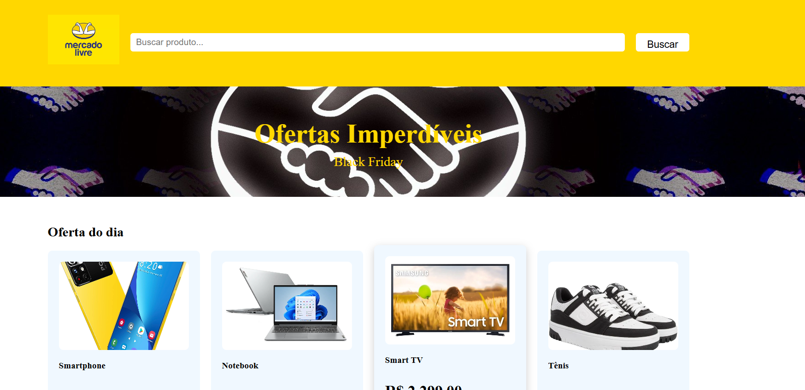

# Clone do Mercado Livre

Projeto desenvolvido como parte do meu processo de **Estudo Prático Guiado**.

## Referência
Projeto recriado seguindo o tutorial do **DEV Club**.  
Vídeo original: *[Assista ao vídeo do YouTube](https://www.youtube.com/watch?v=zX5H0RWRAkM&t=3762s)*

## Tecnologias utilizadas
- HTML  
- CSS  
- JavaScript  

## O que aprendi
- Estruturação de páginas HTML
- Estilização com CSS (layouts, fontes, espaçamentos)
- Manipulação básica de DOM com JavaScript
- Validação simples de campos de formulário
- Funções
- Busca com filtragem

## Como executar
Basta abrir o arquivo `index.html` no navegador.

## Preview
