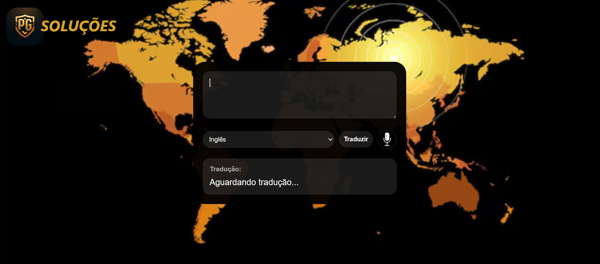

# Site de Tradução com IA

Projeto desenvolvido como parte do meu processo de **Estudo Prático Guiado**.

## Referência
Projeto recriado seguindo o tutorial do **DEV Club**, durate o evento "Missão Programação com IA do Zero".

## Tecnologias utilizadas
- HTML  
- CSS  
- JavaScript  

## O que aprendi
- Estruturação de páginas HTML
- Estilização com CSS (layouts, fontes, espaçamentos)
- Atribuições e interações entre HTML e Javascript
- Validação simples de campos de formulário
- Funções
- Implantação de IA.

## Como executar
Basta abrir o arquivo `index.html` no navegador.

## Preview
