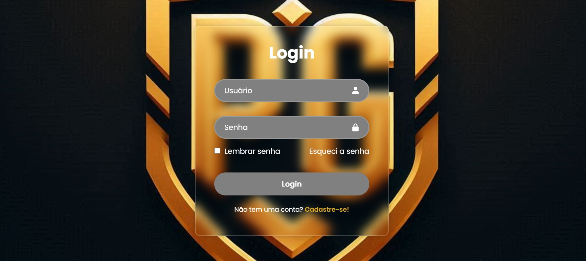

# Tela de Login

Projeto desenvolvido como parte do meu processo de **Estudo Prático Guiado**.

## Referência
Projeto recriado seguindo o tutorial do **Youtube - DEV Club**.  
Vídeo original: *[Assista ao vídeo no YouTube](https://www.youtube.com/watch?v=pXAGoP2G2vE&t=25s)*

## Tecnologias utilizadas
- HTML  
- CSS

## O que aprendi
- Estruturação de páginas HTML
- Estilização com CSS (layouts, fontes, espaçamentos)

## Como executar
Basta abrir o arquivo `index.html` no navegador.

## Preview
